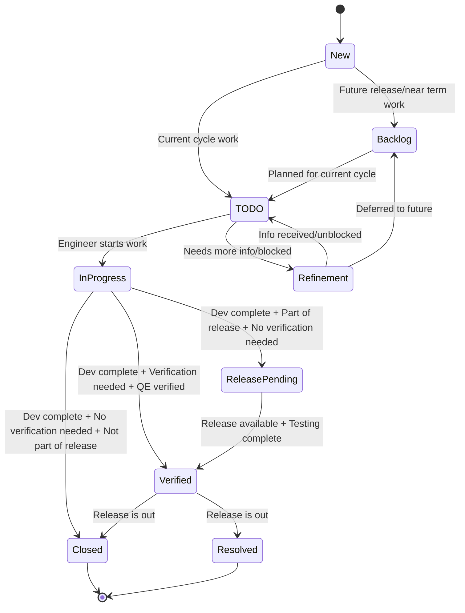
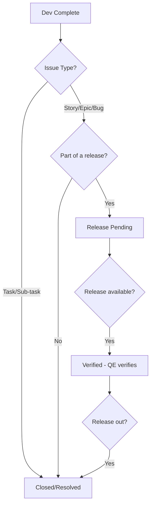

# Jira Workflow

This document describes the state transitions for Jira issues in the AMQ project.

## State Machine

## State Descriptions

### Backlog
Jiras that are not being worked on in the current cycle but are planned for a future release or need to be worked on in the near future.

### TODO
A Jira should be set to TODO if it is planned to be worked on in the current cycle (in the next few weeks).

### Refinement
This is for a Jira that needs more info, for instance:
- Is blocked awaiting some input from another engineer
- Needs some more information from the reporter but is still regarded as important (e.g., a customer issue)

### In Progress
A Jira should be In Progress if an engineer is currently working on it, either implementing or reviewing.

### Release Pending
This state should be used when dev complete but not yet in a release.

### Verified
In a release and testing has taken place.

### Closed/Resolved
Released and done.

## Decision Flow from Dev Complete

When development is complete, choose the next state based on:

### Issue Type Guidelines
- **Tasks/Sub-tasks**: Go directly to Closed when dev complete
- **Stories/Epics/Bugs + Part of release**: Go to Release Pending → Verified (when release is available) → Closed/Resolved
- **Stories/Epics/Bugs + Not part of release**: Go directly to Closed when dev complete

## Story Pointing

Every Jira should be story pointed:

| Points | Effort |
|--------|--------|
| 1 | Less than a day |
| 2 | Up to a week |
| 3 | More than a week |

Points can be added during the investigation stage and changed at any point.

## Unused States

The following states are defined in Jira but **not used** in our workflow:
- TASKING AND ESTIMATION
- CODE REVIEW (use reassignment instead)
- DEV COMPLETE (use Release Pending, Verified, or Closed instead)

## Definition of Ready

Before moving a Jira to In Progress, ensure it meets the definition of ready:
- Sufficient information to start work
- Story pointed (or will be pointed during investigation)
- Not blocked by dependencies

## Definition of Done

### Done: Release Pending
- Code has passed upstream peer review:
  - Review by at least 1 upstream committer
  - Test coverage is complete
  - Docs are updated if applicable
  - Tests pass in upstream CI
- Downstream issue is linked to upstream issue

### Done: Verified
- A productized release is available to test
- Full matrix of tests have been completed

### Done: Closed/Resolved
- Release is out the door
