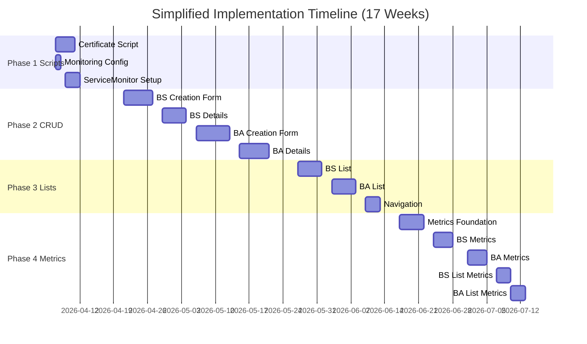

# ActiveMQ Artemis Operator UI Implementation Roadmap

This roadmap outlines the tasks required to implement the OpenShift Console dynamic plugin for the ActiveMQ Artemis Operator.

## Executive Summary

**Goal**: Deliver a basic working UI for BrokerService and BrokerApp CRUD operations  
**User**: Cluster administrators only (kubeadmin)  
**Timeline**: ~17 weeks with 2-3 developers  
**Philosophy**: Ship the simplest thing that works, iterate later

## Scope

### ✅ In Scope (MVP)
- BrokerService and BrokerApp creation forms (Form View + YAML View)
- List views with basic filtering
- Detail views with Overview, YAML, and Resources tabs
- Basic metrics (Memory, CPU, Queue Depth, Consumer Count)
- Certificate generation script (temporary, until operator handles it)
- Prometheus ServiceMonitor setup

### ❌ Out of Scope (Future)
- Multi-tenancy (no developer persona)
- Namespace-based authorization or filtering
- Label suggestions (ConfigMaps, localStorage, drag-and-drop)
- RBAC and approval workflows
- Advanced metrics (per-app breakdowns, aggregations)
- Connectivity testing
- Inline editing of resources

## Implementation Phases

1. **Phase 1: Scripts & Setup** (2 weeks) - Get cluster ready
2. **Phase 2: Core CRUD** (8 weeks) - Creation and detail views
3. **Phase 3: Lists** (3 weeks) - List views and navigation
4. **Phase 4: Metrics** (4 weeks) - Charts and monitoring

**Total**: ~17 weeks

**Note**: Testing and documentation are integrated into each task rather than as a separate phase.

## Wireframe Reference

| View | Wireframe File | Purpose |
|------|----------------|---------|
| **BrokerService Creation** | `wireframe-service-creation.html` | Create form (kubeadmin) |
| **BrokerService List** | `wireframe-service-list.html` | List all services |
| **BrokerService Details** | `wireframe-broker-details-overview.html` | Overview with metrics |
| **BrokerService Resources** | `wireframe-broker-details-resources.html` | Related K8s resources |
| **BrokerApp Creation** | `wirefram-app-creation.html` | Create form (kubeadmin) |
| **BrokerApp List** | `wireframe-app-list.html` | List all apps |
| **BrokerApp Details** | `wireframe-app-details-overview.html` | Overview with connection info |
| **BrokerApp Resources** | `wireframe-app-details-resources.html` | Credentials and certs |

## Technology Stack

- **Framework**: React + TypeScript
- **UI Library**: PatternFly 6
- **State Management**: React Reducers
- **Platform**: OpenShift Console Dynamic Plugin SDK
- **Metrics**: Prometheus integration via OpenShift monitoring
- **Build**: Webpack

---

## Phase 1: Scripts & Setup (2 weeks)

**Goal**: Get a development cluster ready to test the UI

### 1.1 Certificate Generation Script
**Effort**: 3-4 days  
**Owner**: Backend/DevOps engineer

**What**: Script to generate all PKI certificates needed for broker communication

**Why**: Operator doesn't handle cert-manager yet, so we need a workaround

**Tasks**:
```bash
# Inspiration: activemq-artemis-self-provisioning-plugin/scripts/chain-of-trust.js
scripts/
  generate-certs.sh (or .js)
    └─ Generates:
       - Control Plane PKI: broker-cert, operator-manager-ca
       - Data Plane PKI: data-plane-broker-cert, data-plane-ca  
       - App certs: {app-name}-client-cert, {app-name}-prometheus-cert
    └─ Stores as Kubernetes Secrets
```

**Usage**: `./generate-certs.sh my-broker my-app`

**Deliverables**:
- [ ] Script file with inline comments
- [ ] README section explaining usage
- [ ] Example invocation in docs
- [ ] Test: Run script and verify all secrets are created
- [ ] Test: Verify certificates have correct fields (CN, SAN, etc.)
- [ ] Test: Use generated certificates to connect broker and app

---

### 1.2 Monitoring Setup
**Effort**: 1 day  
**Owner**: DevOps engineer

**What**: Enable Prometheus user workload monitoring in OpenShift

**Tasks**:
```bash
# 1. Apply ConfigMap
kubectl apply -f - <<EOF
apiVersion: v1
kind: ConfigMap
metadata:
  name: cluster-monitoring-config
  namespace: openshift-monitoring
data:
  config.yaml: |
    enableUserWorkload: true
EOF

# 2. Verify
kubectl -n openshift-user-workload-monitoring get pods
```

**Deliverables**:
- [ ] Script or doc with exact commands
- [ ] Verification steps documented
- [ ] Test: Verify user workload monitoring pods are running
- [ ] Test: Confirm Prometheus is accessible

---

### 1.3 ServiceMonitor Configuration
**Effort**: 2-3 days  
**Owner**: DevOps engineer  
**Depends on**: 1.1, 1.2

**What**: Configure Prometheus to scrape broker metrics

**Tasks**:
- Create ServiceMonitor YAML for broker pods
- Configure TLS using Data Plane CA from 1.1
- Test with sample PromQL queries (see "Metrics Queries" section below)

**Deliverables**:
- [ ] `scripts/setup-servicemonitor.sh`
- [ ] ServiceMonitor template YAML
- [ ] Test query examples documented
- [ ] Test: Verify ServiceMonitor is created and active
- [ ] Test: Run sample PromQL queries and verify data is returned
- [ ] Test: Verify metrics appear in OpenShift Console monitoring UI

---

## Phase 2: Core CRUD (8 weeks)

**Goal**: Users can create and view BrokerServices and BrokerApps

### 2.1 BrokerService Creation Form
**Effort**: 5-6 days  
**Owner**: Frontend developer  
**Wireframe**: `wireframe-service-creation.html`

**What**: Form to create a BrokerService

**Features**:
- [ ] Form View / YAML View toggle (radio buttons)
- [ ] Name input with DNS-1123 validation
- [ ] Namespace display (read-only from project selector)
- [ ] Labels input: Simple key-value text fields
  - Each label is 2 text inputs (key, value) + remove button
  - "Add Label" button to add another row
  - No ConfigMaps, no localStorage, no drag-and-drop
- [ ] Memory input with unit dropdown (Mi/Gi)
- [ ] YAML editor with syntax highlighting
- [ ] Create button submits to K8s API
- [ ] Cancel button goes back

**Acceptance Criteria**:
- [ ] Can create BrokerService via form view
- [ ] Can create BrokerService via YAML view
- [ ] Form validates required fields (name, memory)
- [ ] Labels add/remove works correctly
- [ ] Resource appears in `kubectl get brokerservices`
- [ ] Error messages display if creation fails
- [ ] Test: Create service with valid inputs → verify success
- [ ] Test: Submit form with missing required fields → verify validation errors
- [ ] Test: Create service via YAML → verify it matches form-created resource
- [ ] Test: Add/remove multiple labels → verify they persist correctly

---

### 2.2 BrokerService Details View
**Effort**: 4-5 days  
**Owner**: Frontend developer  
**Wireframes**: `wireframe-broker-details-overview.html`, `wireframe-broker-details-resources.html`

**What**: Multi-tab detail view for a BrokerService

**Features**:
- [ ] **Overview tab**:
  - Status badge (Running/Pending/Error)
  - Labels display (read-only)
  - Conditions table
  - Placeholder for metrics (filled in Phase 4)
- [ ] **YAML tab**: CodeEditor showing resource YAML
- [ ] **Resources tab**: Table of related resources
  - StatefulSet, Services, Secrets, ConfigMaps
  - Resource name (clickable link), Kind, Status, Created timestamp
  - Colored icons per resource type
- [ ] **Pods tab**: Table of broker pods
  - Pod name, Status, Restarts, Age
- [ ] Breadcrumb: `Brokers > {name}`
- [ ] Action menu: Edit, Delete (future)

**Acceptance Criteria**:
- [ ] All tabs render correctly
- [ ] Clicking resource name navigates to resource detail
- [ ] Status badge reflects actual resource status
- [ ] Conditions table shows operator status
- [ ] Test: Navigate to detail view → verify all tabs load
- [ ] Test: Click on StatefulSet link → verify navigation to StatefulSet detail
- [ ] Test: Verify status updates when broker pods start
- [ ] Test: Check YAML tab shows correct resource definition

---

### 2.3 BrokerApp Creation Form
**Effort**: 6-7 days  
**Owner**: Frontend developer  
**Wireframe**: `wirefram-app-creation.html`

**What**: Form to create a BrokerApp (binds to BrokerService)

**Features**:
- [ ] Form View / YAML View toggle
- [ ] Name input
- [ ] Namespace display (read-only)
- [ ] Application Role input (text field)
- [ ] **Service Selector matchLabels**: Simple key-value pairs
  - Same pattern as BrokerService labels
  - User types key, value, clicks "Add Match Label"
- [ ] **Messaging Capabilities**:
  - Produces To: array of address names
  - Consumes From: array of address names
  - Subscribes To: array of address names
  - Each has: text input + "Add" button + list with remove buttons
- [ ] YAML editor
- [ ] Create/Cancel buttons

**Acceptance Criteria**:
- [ ] Can create BrokerApp via form
- [ ] Can add/remove addresses for each capability
- [ ] Can add/remove selector labels
- [ ] Operator provisions app to matching BrokerService
- [ ] Credentials are created
- [ ] Test: Create app with matching labels → verify it binds to correct service
- [ ] Test: Add multiple addresses to "Produces To" → verify they all appear in spec
- [ ] Test: Create app with non-matching labels → verify it stays pending
- [ ] Test: Verify credentials secret is created after provisioning

---

### 2.4 BrokerApp Details View
**Effort**: 5-6 days  
**Owner**: Frontend developer  
**Wireframes**: `wireframe-app-details-overview.html`, `wireframe-app-details-resources.html`

**What**: Multi-tab detail view for a BrokerApp

**Features**:
- [ ] **Overview tab**:
  - Status badge (Provisioned/Pending/Error)
  - Provisioned Service (clickable link to BrokerService)
  - Application Role
  - **Connection Information** section:
    - Broker Host (with copy button)
    - Acceptor Port (with copy button)
    - Connection Secret (link to secret) -> might not be doable until the operator is integrated with cert-manager
  - **Messaging Capabilities** section:
    - Lists for Produces To, Consumes From, Subscribes To
  - Conditions table
  - Placeholder for metrics (Phase 4)
- [ ] **YAML tab**: CodeEditor
- [ ] **Resources tab**: Table of resources
  - Secrets, ConfigMaps, CertificateRequests, RoleBindings
- [ ] Breadcrumb: `BrokerApps > {name}`

**Acceptance Criteria**:
- [ ] Connection info displays correctly
- [ ] Copy buttons work
- [ ] Link to provisioned service navigates correctly
- [ ] Messaging capabilities display all addresses
- [ ] Test: View provisioned app → verify broker host and port are shown
- [ ] Test: Click copy button → verify value is copied to clipboard
- [ ] Test: Click provisioned service link → navigate to service detail
- [ ] Test: Verify all messaging addresses appear in correct sections

---

## Phase 3: List Views (3 weeks)

**Goal**: Users can browse and navigate BrokerServices and BrokerApps

### 3.1 BrokerService List
**Effort**: 4-5 days  
**Owner**: Frontend developer  
**Wireframe**: `wireframe-service-list.html`

**What**: List view for all BrokerServices in the cluster

**Features**:
- [ ] Table with columns: Name, Namespace, Status, Labels, Created
- [ ] Click on name to navigate to details
- [ ] Filter/search box for name search
- [ ] "Create BrokerService" button
- [ ] Pagination controls

**Acceptance Criteria**:
- [ ] Table displays all BrokerServices from all namespaces
- [ ] Clicking service name navigates to detail view
- [ ] Search box filters by name
- [ ] Create button navigates to creation form
- [ ] List updates automatically when resources change
- [ ] Test: Create multiple services in different namespaces → verify all appear
- [ ] Test: Type in search box → verify list filters correctly
- [ ] Test: Click service name → navigate to detail view
- [ ] Test: Create new service → verify it appears in list without refresh

**Note**: Memory usage metrics will be added in Phase 4

---

### 3.2 BrokerApp List
**Effort**: 4-5 days  
**Owner**: Frontend developer  
**Wireframe**: `wireframe-app-list.html`

**What**: List view for all BrokerApps in the cluster

**Features**:
- [ ] Table with columns: Name, Namespace, Status, Provisioned To, Created
- [ ] Click on name to navigate to details
- [ ] Click on "Provisioned To" service name to navigate to service details
- [ ] Filter/search box for name search
- [ ] "Create BrokerApp" button
- [ ] Pagination controls

**Acceptance Criteria**:
- [ ] Table displays all BrokerApps from all namespaces
- [ ] Clicking app name navigates to detail view
- [ ] Clicking provisioned service navigates to service detail
- [ ] Search box filters by name
- [ ] Create button navigates to creation form
- [ ] List updates automatically when resources change
- [ ] Test: Create multiple apps → verify all appear in list
- [ ] Test: Click "Provisioned To" service link → navigate to service detail
- [ ] Test: Search for app by name → verify filtering works
- [ ] Test: Delete an app → verify it disappears from list

**Note**: Queue Depth and Consumer Count metrics will be added in Phase 4

---

### 3.3 Navigation Integration
**Effort**: 2-3 days  
**Owner**: Frontend developer  
**Dependencies**: 3.1, 3.2

**What**: Integrate list and detail views into OpenShift Console navigation

**Features**:
- [ ] Add "Brokers" menu item under Workloads (points to list)
- [ ] Add "BrokerApps" menu item under Workloads (points to list)
- [ ] Configure routes for all views (take inspiration from SPP)
  - Same pattern for BrokerApp
- [ ] Breadcrumb navigation on all pages

**Acceptance Criteria**:
- [ ] Brokers menu item appears in sidebar under Workloads
- [ ] BrokerApps menu item appears in sidebar under Workloads
- [ ] All routes navigate correctly
- [ ] Breadcrumbs show correct hierarchy
- [ ] Test: Click "Brokers" in sidebar → navigate to list view
- [ ] Test: Navigate to detail → verify breadcrumbs show "Brokers > {name}"
- [ ] Test: All URLs are bookmarkable and refreshable
- [ ] Documentation: Add screenshots of navigation to README

---

## Phase 4: Metrics Integration (3 weeks)

**Goal**: Display performance metrics for BrokerServices and BrokerApps

### 4.1 Metrics Foundation
**Effort**: 4-5 days  
**Owner**: Frontend developer  
**Dependencies**: 1.3 (ServiceMonitor setup)

**What**: Build reusable infrastructure for displaying Prometheus metrics (extract from SPP where applicatable)

**Features**:
- [ ] Create reusable `MetricsChart` component
- [ ] Integrate with OpenShift monitoring API
- [ ] Time range selector (1h, 6h, 24h)
- [ ] chart rendering
- [ ] Loading and error states
- [ ] No data state

**Acceptance Criteria**:
- [ ] Chart component accepts query and renders line chart
- [ ] Time range selector updates query and refreshes data
- [ ] Loading spinner shows while fetching
- [ ] Error message displays if query fails
- [ ] "No data" message shows if query returns empty
- [ ] Test: Render chart with valid query → verify data displays
- [ ] Test: Change time range → verify chart updates
- [ ] Test: Use invalid query → verify error message appears
- [ ] Test: Query with no data → verify "No data" state shows

---

### 4.2 BrokerService Metrics
**Effort**: 3-4 days  
**Owner**: Frontend developer  
**Dependencies**: 4.1, 2.2 (Details view)

**What**: Add metrics charts to BrokerService overview tab

**Features**:
- [ ] Memory Usage chart
- [ ] CPU Usage chart
- [ ] Shared time range selector (applies to both charts)
- [ ] Charts display in grid layout

**Acceptance Criteria**:
- [ ] Memory chart shows container memory usage over time
- [ ] CPU chart shows CPU rate over time
- [ ] Time range selector updates both charts
- [ ] Charts show "No data" if broker has no pods
- [ ] Broker name is correctly substituted in queries
- [ ] Test: View broker with running pods → verify charts show data
- [ ] Test: Change time range → verify both charts update
- [ ] Test: View broker with no pods → verify "No data" message
- [ ] Test: Compare chart data with Prometheus UI → verify accuracy

---

### 4.3 BrokerApp Metrics
**Effort**: 3-4 days  
**Owner**: Frontend developer  
**Dependencies**: 4.1, 2.4 (Details view)

**What**: Add metrics charts to BrokerApp overview tab

**Features**:
- [ ] Queue Depth chart (derived from Message Count - Delivering Count)
- [ ] Consumer Count chart
- [ ] Shared time range selector (applies to both charts)
- [ ] Charts display in grid layout

**Acceptance Criteria**:
- [ ] Queue Depth chart shows waiting messages over time
- [ ] Consumer Count chart shows active consumers over time
- [ ] Time range selector updates both charts
- [ ] Charts show "No data" if app has no activity
- [ ] App role is correctly substituted in queries
- [ ] Test: Send messages to app → verify queue depth increases
- [ ] Test: Start consumer → verify consumer count chart updates
- [ ] Test: Change time range → verify both charts refresh
- [ ] Test: App with no messages → verify charts show zero or "No data"

---

### 4.4 BrokerService List Metrics
**Effort**: 2-3 days  
**Owner**: Frontend developer  
**Dependencies**: 4.1 (Metrics Foundation), 3.1 (BrokerService List)

**What**: Add Memory usage column to BrokerService list

**Features**:
- [ ] Add Memory column to table (shows actual usage from Prometheus)
- [ ] Format memory values with units (Mi/Gi)
- [ ] Show loading state while fetching metrics
- [ ] Show "N/A" if metrics unavailable

**Acceptance Criteria**:
- [ ] Memory column displays actual container memory usage
- [ ] Values update as metrics change
- [ ] Column shows "N/A" for services with no running pods
- [ ] List performance remains good with metrics queries
- [ ] Test: View list → verify memory values match detail view
- [ ] Test: Service with no pods → verify "N/A" displayed

---

### 4.5 BrokerApp List Metrics
**Effort**: 2-3 days  
**Owner**: Frontend developer  
**Dependencies**: 4.1 (Metrics Foundation), 3.2 (BrokerApp List)

**What**: Add Queue Depth and Consumer Count columns to BrokerApp list

**Features**:
- [ ] Add Queue Depth column (Message Count - Delivering Count)
- [ ] Add Consumer Count column
- [ ] Show loading state while fetching metrics
- [ ] Show "N/A" if metrics unavailable

**Acceptance Criteria**:
- [ ] Queue Depth column shows current waiting messages
- [ ] Consumer Count column shows active consumers
- [ ] Values update as metrics change
- [ ] Columns show "N/A" for apps with no activity
- [ ] List performance remains good with metrics queries
- [ ] Test: Send messages → verify queue depth updates in list
- [ ] Test: Start consumer → verify consumer count updates
- [ ] Test: App with no messages → verify "N/A" displayed

---

## Timeline Summary



**Total Duration**: ~17 weeks (vs. 30 weeks for full feature set)

**Note**: Testing is integrated into each task's acceptance criteria. Documentation should be written as each feature is completed.

---

## Documentation Guidelines

Since testing and documentation are integrated into each task, developers should:

**As you complete each task**:
- [ ] Update README.md with setup/usage instructions if applicable
- [ ] Add inline code comments for complex logic
- [ ] Document any environment variables or configuration
- [ ] Take screenshots of completed UI features
- [ ] Update this ROADMAP.md by checking off completed items

**By end of each phase**:
- [ ] Verify all task checkboxes are complete
- [ ] Create/update relevant docs in `docs/` folder
- [ ] Record a short demo video showing the workflow
- [ ] Document any known issues or limitations

**Final deliverables** (by end of Phase 4):
- [ ] README.md with complete installation and usage guide
- [ ] docs/DEVELOPMENT.md for local development setup
- [ ] docs/TROUBLESHOOTING.md with common issues and solutions
- [ ] docs/USER_GUIDE.md with screenshots of all features
- [ ] Demo video showing full BrokerService and BrokerApp workflow

---

## Key Simplifications

Compared to the full roadmap, this simplified version removes:

1. **No Multi-Tenancy**:
   - No developer persona
   - No namespace isolation
   - Everything as kubeadmin

2. **No Authorization**:
   - No namespace filter labels
   - No ConfigMap management
   - No RBAC setup

3. **No Label Suggestions**:
   - No ConfigMap loading
   - No previously used labels (localStorage)
   - Simple manual text input only

4. **No Drag-and-Drop**:
   - Simple form inputs instead
   - Reduces complexity significantly

5. **Minimal Metrics**:
   - Only basic charts
   - No per-app breakdowns
   - No advanced aggregations

---

## Future Enhancements (Post-MVP)

After the basic implementation is complete and stable, consider adding:

- Multi-tenancy with developer persona
- Namespace-based authorization
- Label suggestion system with ConfigMaps
- Drag-and-drop label selectors
- Advanced metrics and monitoring
- Approval workflows
- Connectivity testing
- Selector change warnings
