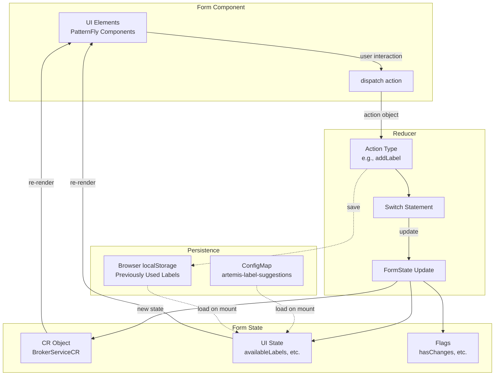
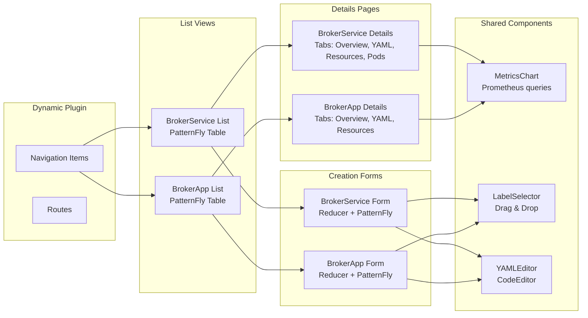
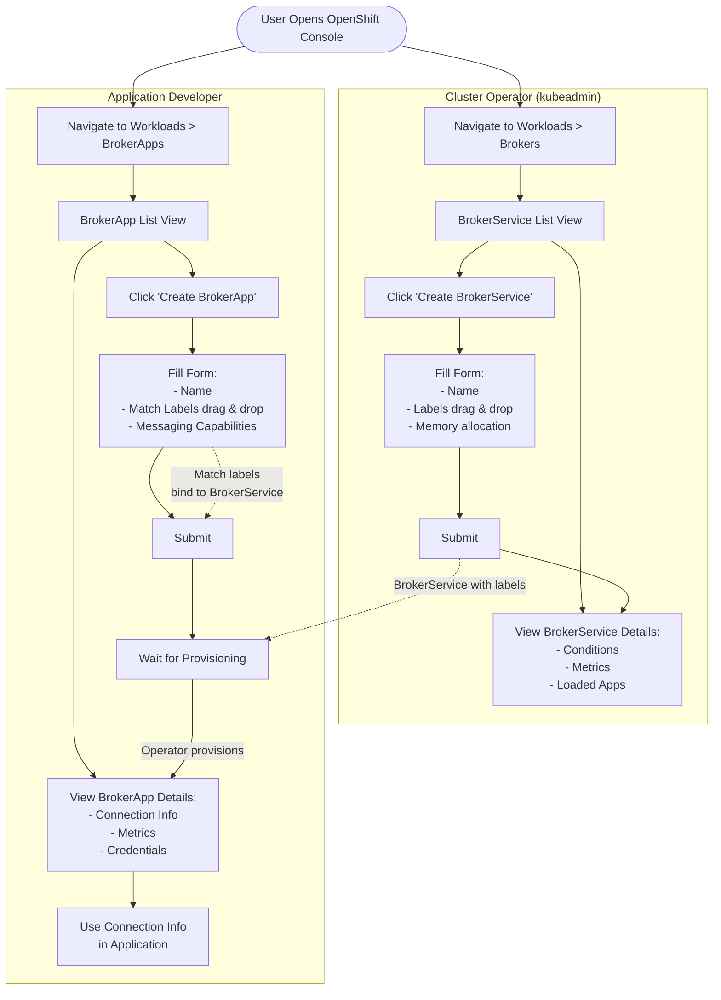
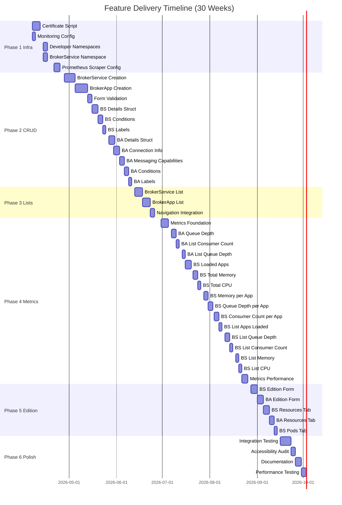
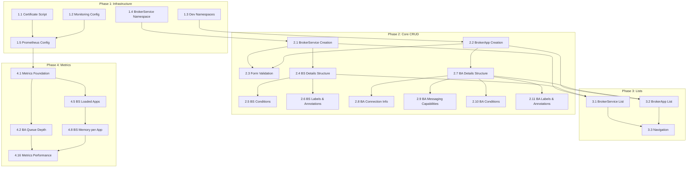

# ActiveMQ Artemis Operator UI Implementation Roadmap

This roadmap outlines the tasks required to implement the OpenShift Console dynamic plugin for the ActiveMQ Artemis Operator based on the wireframe designs.

## Overview

The implementation is divided into 4 phases:
1. **Infrastructure Setup** - Scripts and cluster configuration (temporary workarounds until operator supports these)
2. **Core CRUD Operations** - Creation and details views for both BrokerService and BrokerApp
3. **List Views & Navigation** - List pages with basic information
4. **Metrics & Advanced Features** - Embedded metrics, aggregations, and monitoring integration

## Team Composition & Timeline

**Team Size**: 2-3 developers
**Timeline**: ~30 weeks (targeting end-of-year release)
**Development Velocity**: Progressive rollout with working features delivered incrementally

## Wireframe Quick Reference

All wireframes are available as standalone HTML files that can be opened in any browser:

| View | Wireframe File | Purpose |
|------|----------------|---------|
| **BrokerService Creation** | `wireframe-service-creation.html` | Day 1 form for cluster operators to create messaging infrastructure |
| **BrokerService List** | `wireframe-service-list.html` | Overview of all broker services with metrics |
| **BrokerService Details** | `wireframe-broker-details-overview.html` | Overview tab with metrics, loaded apps, conditions |
| **BrokerService Resources** | `wireframe-broker-details-resources.html` | Resources tab showing managed Kubernetes objects |
| **BrokerApp Creation** | `wirefram-app-creation.html` | Day 1 form for developers to create messaging apps |
| **BrokerApp List** | `wireframe-app-list.html` | Overview of all broker apps with provisioning status |
| **BrokerApp Details** | `wireframe-app-details-overview.html` | Overview tab with connection info, metrics, capabilities |
| **BrokerApp Resources** | `wireframe-app-details-resources.html` | Resources tab showing credentials and certificates |

**How to view**: `firefox wireframe-service-creation.html` or `chromium wireframe-app-list.html`

## Technology Stack

- **Framework**: React + TypeScript
- **UI Library**: PatternFly 6
- **State Management**: React Reducers (following existing patterns from activemq-artemis-self-provisioning-plugin)
- **Platform**: OpenShift Console Dynamic Plugin SDK
- **Metrics**: Prometheus integration via OpenShift monitoring
- **Build**: Webpack

**PatternFly 6 Benefits**:
- Built-in drag-and-drop components (no need for external libraries)
- Form components with built-in validation
- Consistent OpenShift Console styling
- Accessibility (a11y) built-in

## Architecture Overview

### Reducer Pattern

The plugin uses React Reducers for state management, following the pattern established in `activemq-artemis-self-provisioning-plugin`.



### Component Structure



## User Journey Flow



## Progressive Feature Rollout



## Task Dependencies



## Phase 1: Infrastructure Setup Scripts

These scripts represent missing operator functionality. Most of this work will eventually be integrated into the operator, but for now, we need scripts to set up the environment.

### 1.1 Certificate Generation Script
**Priority**: Critical (blocking)
**Estimated Effort**: 3-5 days
**Dependencies**: None

Create a script that generates PKI certificates for both Control Plane and Data Plane communication, mimicking what cert-manager would do.

- Take inspiration from `/home/tlavocat/dev/activemq-artemis-self-provisioning-plugin/scripts/chain-of-trust.js`
- Generate Control Plane PKI: `broker-cert`, `operator-manager-ca`
- Generate Data Plane PKI: `data-plane-broker-cert`, `data-plane-ca`
- Generate app-specific client certificates (e.g., `my-payment-app-client-cert`, `my-payment-app-prometheus-client-cert`)
- Store certificates as Kubernetes Secrets
- **Note**: This script will be removed once the operator integrates cert-manager support

### 1.2 Cluster Monitoring Configuration Script
**Priority**: Critical (blocking for metrics)
**Estimated Effort**: 1-2 days
**Dependencies**: None

Configure OpenShift cluster monitoring to enable user workload monitoring (required for namespace-scoped Prometheus scraping).

```yaml
apiVersion: v1
kind: ConfigMap
metadata:
  name: cluster-monitoring-config
  namespace: openshift-monitoring
data:
  config.yaml: |
    enableUserWorkload: true
```

- Apply the ConfigMap to `openshift-monitoring` namespace
- Verify user workload monitoring is enabled
- Document how to verify the configuration

### 1.3 Developer Namespaces Setup Script (user1 & user2)
**Priority**: High
**Estimated Effort**: 2-3 days
**Dependencies**: None

Create namespaces for developer personas with appropriate RBAC and label suggestion ConfigMaps.

For each developer namespace (e.g., `my-application`, `payments-app`):
- Create namespace with monitoring label: `openshift.io/cluster-monitoring: "true"`
- Create `artemis-label-suggestions` ConfigMap with developer-appropriate labels:
  ```yaml
  apiVersion: v1
  kind: ConfigMap
  metadata:
    name: artemis-label-suggestions
    namespace: my-application
  data:
    labels: |
      - forWorkQueue: "true"
      - forEventStreaming: "true"
      - tier: "production"
      - tier: "staging"
      - tier: "dev"
  ```
- Create RoleBindings for `user1` and `user2` accounts
- Grant permissions to create BrokerApps (but NOT BrokerServices)
- Verify developers can only access their assigned namespaces

### 1.4 BrokerService Namespace Setup Script
**Priority**: High
**Estimated Effort**: 2-3 days
**Dependencies**: None

Create infrastructure namespace for BrokerService resources (e.g., `messaging-infra`).

- Create namespace with monitoring label: `openshift.io/cluster-monitoring: "true"`
- Create `artemis-label-suggestions` ConfigMap with infrastructure-focused labels:
  ```yaml
  apiVersion: v1
  kind: ConfigMap
  metadata:
    name: artemis-label-suggestions
    namespace: messaging-infra
  data:
    labels: |
      - forWorkQueue: "true"
      - forEventStreaming: "true"
      - tier: "production"
      - region: "us-east"
      - region: "eu-west"
  ```
- Grant cluster-admin or appropriate elevated permissions to `kubeadmin` persona
- Verify kubeadmin can create BrokerServices

### 1.5 Prometheus Scraper Configuration Scripts
**Priority**: High (blocking for metrics)
**Estimated Effort**: 3-4 days
**Dependencies**: 1.1 (Certificate script), 1.2 (Monitoring config), 1.3 & 1.4 (Namespaces)

Configure Prometheus to scrape metrics from both BrokerService and BrokerApp namespaces.

**For BrokerApp namespaces:**
- Create ServiceMonitor resources pointing to broker acceptor endpoints
- Configure TLS with Data Plane CA certificate (from `data-plane-ca` ConfigMap)
- Use app-specific Prometheus client certificates for authentication
- Test metrics scraping with sample queries

**For BrokerService namespace:**
- Create ServiceMonitor for broker management endpoints
- Configure Control Plane PKI for operator metrics
- Set up aggregation queries for multi-app metrics
- Verify metrics are available in OpenShift monitoring UI

**Deliverables:**
- Script to generate ServiceMonitor YAML for each namespace
- Secrets containing Prometheus client certificates
- Sample PromQL queries for testing
- Documentation on verifying scraping is working

---

## Phase 2: Core CRUD Operations

This phase focuses on creating and viewing individual resources. Forms should have validation, labels should be draggable, and YAML/Form view toggles should work.

### 2.1 BrokerService Creation Form
**Priority**: Critical
**Estimated Effort**: 7 days
**Dependencies**: 1.4 (BrokerService namespace setup)

Implement `wireframe-service-creation.html` as an OpenShift Console dynamic plugin view.

**Wireframe Reference**: `wireframe-service-creation.html`


**Features:**
- Form View / YAML View toggle (radio buttons)
- Name input field with validation (DNS-1123 compliant)
- Namespace display (read-only, reflects project selector)
- **Labels section with three sources:**
  - Available Labels from `artemis-label-suggestions` ConfigMap (gray badges)
  - Previously Used Labels from browser localStorage (purple badges)
  - Custom label input with + button
- Full drag-and-drop functionality using **PatternFly 6 DualListSelector** or custom HTML5 Drag and Drop
- Info box explaining ConfigMap mechanism for admins
- Infrastructure & Capacity: Memory/RAM input
- YAML editor with syntax highlighting (download, copy, expand buttons)
- Form validation before submission
- Error handling and user feedback

#### Reducer Implementation

Create `src/reducers/broker-service/reducer.ts` following the pattern from `activemq-artemis-self-provisioning-plugin`.

**State Structure** (`broker-service/import-types.ts`):
```typescript
import { BrokerServiceCR } from '@app/k8s/types';
import { BaseFormState, EditorType } from '../reducer';

export interface BrokerServiceFormState extends BaseFormState {
  editorType: EditorType.BROKER_SERVICE;
  cr?: BrokerServiceCR;
  hasChanges: boolean;
  yamlHasUnsavedChanges: boolean;
  // Available labels from ConfigMap
  availableLabels: Array<{ key: string; value: string }>;
  // Previously used labels from localStorage
  previouslyUsedLabels: Array<{ key: string; value: string }>;
}
```

**Operations Enum** (start at 5000 for BrokerService):
```typescript
export enum BrokerServiceReducerOperations {
  setBrokerServiceName = 5000,
  setNamespace,
  addLabel,
  removeLabel,
  setMemoryLimit,
  setAvailableLabels,
  setPreviouslyUsedLabels,
  syncFromYAML,
  syncToYAML,
}
```

**Action Types**:
```typescript
export type BrokerServiceReducerActions =
  | SetBrokerServiceNameAction
  | SetNamespaceAction
  | AddLabelAction
  | RemoveLabelAction
  | SetMemoryLimitAction
  | SetAvailableLabelsAction
  | SetPreviouslyUsedLabelsAction
  | SyncFromYAMLAction
  | SyncToYAMLAction;

interface SetBrokerServiceNameAction extends ReducerActionBase {
  operation: BrokerServiceReducerOperations.setBrokerServiceName;
  payload: string;
}

interface AddLabelAction extends ReducerActionBase {
  operation: BrokerServiceReducerOperations.addLabel;
  payload: { key: string; value: string };
}

// ... more action interfaces
```

**Reducer Function**:
```typescript
export const brokerServiceReducer: React.Reducer<
  BrokerServiceFormState,
  BrokerServiceReducerActions
> = (prevState, action) => {
  const formState = { ...prevState };
  if (!formState.cr) throw new Error('cr should not be undefined');

  switch (action.operation) {
    case BrokerServiceReducerOperations.setBrokerServiceName:
      formState.cr.metadata.name = action.payload;
      formState.hasChanges = true;
      return formState;

    case BrokerServiceReducerOperations.addLabel:
      if (!formState.cr.metadata.labels) {
        formState.cr.metadata.labels = {};
      }
      formState.cr.metadata.labels[action.payload.key] = action.payload.value;
      formState.hasChanges = true;
      // Add to previously used labels in localStorage
      const prevUsed = JSON.parse(localStorage.getItem('artemis-broker-service-labels') || '[]');
      prevUsed.push(action.payload);
      localStorage.setItem('artemis-broker-service-labels', JSON.stringify(prevUsed));
      return formState;

    case BrokerServiceReducerOperations.removeLabel:
      if (formState.cr.metadata.labels) {
        delete formState.cr.metadata.labels[action.payload.key];
        formState.hasChanges = true;
      }
      return formState;

    // ... more cases
    default:
      return formState;
  }
};
```

**Validation Function**:
```typescript
export const areMandatoryValuesBrokerServiceSet = (
  formState: BrokerServiceFormState
): boolean => {
  if (!formState.cr?.metadata?.name) return false;
  if (!formState.cr?.metadata?.namespace) return false;
  // At least one label is required for service discovery
  if (!formState.cr?.metadata?.labels || Object.keys(formState.cr.metadata.labels).length === 0) {
    return false;
  }
  return true;
};
```

**PatternFly 6 Components to Use**:
- `Form`, `FormGroup` for form structure
- `TextInput` for name and custom label inputs
- `DualListSelector` for label drag-and-drop (or custom drag handlers)
- `Badge` for label display
- `CodeEditor` for YAML view
- `Radio` for Form/YAML toggle
- `Alert` for info box
- `Button` for actions

**Testing:**
- Verify ConfigMap labels are loaded correctly
- Test drag-and-drop in different browsers
- Verify localStorage persistence across sessions
- Test form-to-YAML and YAML-to-form synchronization
- Create a BrokerService and verify it appears in the cluster
- Test reducer actions with unit tests

**Acceptance Criteria:**
- Can create BrokerService via form view
- Can create BrokerService via YAML view
- Labels from ConfigMap are displayed
- Custom labels can be added
- Previously used labels persist in localStorage
- Reducer properly manages state transitions
- Form validation prevents invalid submissions

### 2.2 BrokerApp Creation Form
**Priority**: Critical
**Estimated Effort**: 8 days
**Dependencies**: 1.3 (Developer namespace setup), 2.1 (BrokerService creation, for testing binding)

Implement `wirefram-app-creation.html` as an OpenShift Console dynamic plugin view.

**Wireframe Reference**: `wirefram-app-creation.html`


**Features:**
- Form View / YAML View toggle
- Name input with validation
- Namespace display (read-only)
- Application Role input for RBAC
- **Service Selector with three label sources** (same as 2.1, but for matchLabels)
- Full drag-and-drop for matchLabels using **PatternFly 6 components**
- **Messaging Capabilities section:**
  - Produces To (blue border) - dynamic address list
  - Consumes From (green border) - dynamic address list
  - Subscribes To (purple border) - dynamic address list
  - Add/remove buttons for each capability
- YAML editor with toolbar
- Form validation (ensure at least one capability is defined)

#### Reducer Implementation

Create `src/reducers/broker-app/reducer.ts` following the same pattern.

**State Structure** (`broker-app/import-types.ts`):
```typescript
import { BrokerAppCR } from '@app/k8s/types';
import { BaseFormState, EditorType } from '../reducer';

export interface BrokerAppFormState extends BaseFormState {
  editorType: EditorType.BROKER_APP;
  cr?: BrokerAppCR;
  hasChanges: boolean;
  yamlHasUnsavedChanges: boolean;
  // Available labels from ConfigMap (for selector matchLabels)
  availableLabels: Array<{ key: string; value: string }>;
  // Previously used labels from localStorage
  previouslyUsedLabels: Array<{ key: string; value: string }>;
  // UI state for messaging capabilities
  producesToAddresses: string[];
  consumesFromAddresses: string[];
  subscribesToAddresses: string[];
}
```

**Operations Enum** (start at 6000 for BrokerApp):
```typescript
export enum BrokerAppReducerOperations {
  setBrokerAppName = 6000,
  setNamespace,
  setApplicationRole,
  addMatchLabel,
  removeMatchLabel,
  addProducesToAddress,
  removeProducesToAddress,
  addConsumesFromAddress,
  removeConsumesFromAddress,
  addSubscribesToAddress,
  removeSubscribesToAddress,
  setAvailableLabels,
  setPreviouslyUsedLabels,
  syncFromYAML,
  syncToYAML,
}
```

**Action Types**:
```typescript
export type BrokerAppReducerActions =
  | SetBrokerAppNameAction
  | SetNamespaceAction
  | SetApplicationRoleAction
  | AddMatchLabelAction
  | RemoveMatchLabelAction
  | AddProducesToAddressAction
  | RemoveProducesToAddressAction
  | AddConsumesFromAddressAction
  | RemoveConsumesFromAddressAction
  | AddSubscribesToAddressAction
  | RemoveSubscribesToAddressAction
  | SetAvailableLabelsAction
  | SetPreviouslyUsedLabelsAction
  | SyncFromYAMLAction
  | SyncToYAMLAction;

interface SetBrokerAppNameAction extends ReducerActionBase {
  operation: BrokerAppReducerOperations.setBrokerAppName;
  payload: string;
}

interface AddMatchLabelAction extends ReducerActionBase {
  operation: BrokerAppReducerOperations.addMatchLabel;
  payload: { key: string; value: string };
}

interface AddProducesToAddressAction extends ReducerActionBase {
  operation: BrokerAppReducerOperations.addProducesToAddress;
  payload: string; // address name
}

// ... more action interfaces
```

**Reducer Function**:
```typescript
export const brokerAppReducer: React.Reducer<
  BrokerAppFormState,
  BrokerAppReducerActions
> = (prevState, action) => {
  const formState = { ...prevState };
  if (!formState.cr) throw new Error('cr should not be undefined');
  if (!formState.cr.spec) throw new Error('spec should not be undefined');

  switch (action.operation) {
    case BrokerAppReducerOperations.setBrokerAppName:
      formState.cr.metadata.name = action.payload;
      formState.hasChanges = true;
      return formState;

    case BrokerAppReducerOperations.addMatchLabel:
      if (!formState.cr.spec.selector) {
        formState.cr.spec.selector = { matchLabels: {} };
      }
      if (!formState.cr.spec.selector.matchLabels) {
        formState.cr.spec.selector.matchLabels = {};
      }
      formState.cr.spec.selector.matchLabels[action.payload.key] = action.payload.value;
      formState.hasChanges = true;
      // Add to previously used labels in localStorage
      const prevUsed = JSON.parse(localStorage.getItem('artemis-broker-app-labels') || '[]');
      prevUsed.push(action.payload);
      localStorage.setItem('artemis-broker-app-labels', JSON.stringify(prevUsed));
      return formState;

    case BrokerAppReducerOperations.removeMatchLabel:
      if (formState.cr.spec.selector?.matchLabels) {
        delete formState.cr.spec.selector.matchLabels[action.payload.key];
        formState.hasChanges = true;
      }
      return formState;

    case BrokerAppReducerOperations.addProducesToAddress:
      if (!formState.cr.spec.capabilities) {
        formState.cr.spec.capabilities = [];
      }
      const producesCapability = formState.cr.spec.capabilities.find(c => c.producerOf);
      if (producesCapability && producesCapability.producerOf) {
        producesCapability.producerOf.push({ address: action.payload });
      } else {
        formState.cr.spec.capabilities.push({
          producerOf: [{ address: action.payload }]
        });
      }
      formState.producesToAddresses.push(action.payload);
      formState.hasChanges = true;
      return formState;

    case BrokerAppReducerOperations.removeProducesToAddress:
      if (formState.cr.spec.capabilities) {
        const producesCapability = formState.cr.spec.capabilities.find(c => c.producerOf);
        if (producesCapability?.producerOf) {
          producesCapability.producerOf = producesCapability.producerOf.filter(
            a => a.address !== action.payload
          );
        }
      }
      formState.producesToAddresses = formState.producesToAddresses.filter(
        a => a !== action.payload
      );
      formState.hasChanges = true;
      return formState;

    // Similar cases for consumesFrom and subscribesTo...

    default:
      return formState;
  }
};
```

**Validation Function**:
```typescript
export const areMandatoryValuesBrokerAppSet = (
  formState: BrokerAppFormState
): boolean => {
  if (!formState.cr?.metadata?.name) return false;
  if (!formState.cr?.metadata?.namespace) return false;
  if (!formState.cr?.spec?.selector?.matchLabels ||
      Object.keys(formState.cr.spec.selector.matchLabels).length === 0) {
    return false;
  }
  // At least one capability must be defined
  if (!formState.cr?.spec?.capabilities || formState.cr.spec.capabilities.length === 0) {
    return false;
  }
  return true;
};
```

**PatternFly 6 Components to Use**:
- `Form`, `FormGroup`, `FormSection` for form structure
- `TextInput` for name, role, and address inputs
- `DualListSelector` for matchLabel drag-and-drop
- `Badge` for label and address display
- `CodeEditor` for YAML view
- `Radio` for Form/YAML toggle
- `Alert` for info box
- `Button` with `PlusCircleIcon` and `MinusCircleIcon` for add/remove
- `Panel` with custom border colors for messaging capabilities sections

**Testing:**
- Verify matchLabels can discover BrokerServices
- Test that labels match available BrokerServices in cluster
- Test messaging capabilities input (add/remove addresses)
- Verify YAML generation includes all capabilities
- Create a BrokerApp and verify operator provisions it
- Test reducer actions with unit tests
- Test form validation prevents invalid submissions

**Acceptance Criteria:**
- Can create BrokerApp via form view
- Service selector matchLabels work correctly
- Messaging capabilities are properly defined
- BrokerApp binds to a BrokerService with matching labels
- Reducer properly manages complex state (labels + capabilities)
- Can add/remove multiple addresses per capability type

### 2.3 Form Validation & Error Handling (Intermediate Task)
**Priority**: High
**Estimated Effort**: 2-3 days
**Dependencies**: 2.1, 2.2

Add comprehensive validation and error handling to both creation forms.

- DNS-1123 validation for resource names
- Label format validation (key: "value" pairs)
- Duplicate label prevention
- Required field validation
- Namespace quota checks (if applicable)
- Display validation errors inline
- Handle API errors gracefully (e.g., conflict, unauthorized)
- Show success/failure notifications

### 2.4 BrokerService Details Page Structure
**Priority**: Critical
**Estimated Effort**: 4 days
**Dependencies**: 2.1 (to have resources to view)

Implement the tabbed structure for BrokerService details page.

**Wireframe References**:
- `wireframe-broker-details-overview.html` - Overview tab
- `wireframe-broker-details-resources.html` - Resources tab


**Features:**
- Breadcrumb navigation: `Brokers > BrokerService Name`
- Status badge (Running, Pending, Error)
- Tab navigation: **Overview**, **YAML**, **Resources**, **Pods**
- Active tab highlighting
- Page header with resource name and namespace
- Empty state for each tab (content added in later tasks)

**Testing:**
- Navigate between tabs
- Verify active tab styling
- Test breadcrumb navigation back to list view
- Verify page renders for different BrokerService statuses

### 2.5 BrokerService Details - Conditions Section
**Priority**: Medium
**Estimated Effort**: 2-3 days
**Dependencies**: 2.4

Implement the Conditions table in the Overview tab.

**Features:**
- Display conditions table with columns: Type, Status, Last Transition, Reason, Message
- Status icons (green checkmark for True, red X for False)
- Timestamp formatting
- Empty state if no conditions

**Testing:**
- Verify conditions are fetched from CR status
- Test with different condition states
- Verify timestamps are human-readable

### 2.6 BrokerService Details - Labels & Annotations Section
**Priority**: Medium
**Estimated Effort**: 2 days
**Dependencies**: 2.4

Display labels and annotations in the Details section of the Overview tab.

**Features:**
- Labels displayed as compact badges
- Annotations as key-value list
- Empty state if none exist
- Copy-to-clipboard functionality

**Testing:**
- Verify labels from BrokerService metadata are displayed
- Test with many labels (ensure layout doesn't break)
- Test copy functionality

### 2.7 BrokerApp Details Page Structure
**Priority**: Critical
**Estimated Effort**: 4 days
**Dependencies**: 2.2 (to have resources to view)

Implement the tabbed structure for BrokerApp details page.

**Wireframe References**:
- `wireframe-app-details-overview.html` - Overview tab
- `wireframe-app-details-resources.html` - Resources tab


**Features:**
- Breadcrumb navigation: `BrokerApps > BrokerApp Name`
- Status badge (Provisioned, Pending, Error)
- Provisioned service indicator (shows which BrokerService it's bound to)
- Tab navigation: **Overview**, **YAML**, **Resources**
- Active tab highlighting
- Empty state for each tab

**Testing:**
- Navigate between tabs
- Verify provisioned service link navigates to BrokerService details
- Test with unprovisioned app (Pending state)

### 2.8 BrokerApp Details - Connection Information Section
**Priority**: High
**Estimated Effort**: 3-4 days
**Dependencies**: 2.7, 1.1 (Certificate script for connection secrets)

Implement the Connection Information section in the Overview tab.

**Features:**
- Display broker host DNS address (e.g., `ex-aao-0-svc.default.svc.cluster.local`)
- Display acceptor port (e.g., `61617`)
- Reference to connection secret with clickable link
- **Connectivity Tester:**
  - "Run Connectivity Test" button
  - Mock test result showing TLS validation steps
  - Success/failure indicators
  - Expandable details

**Testing:**
- Verify connection details match the BrokerService endpoint
- Test connectivity tester (can be mock for now)
- Verify secret link navigates to Resources tab
- Test with different acceptor ports

### 2.9 BrokerApp Details - Messaging Capabilities Section
**Priority**: Medium
**Estimated Effort**: 2-3 days
**Dependencies**: 2.7

Display the Messaging Capabilities section in the Overview tab.

**Features:**
- **Produces To** (blue border): List of queues/topics
- **Consumes From** (green border): List of queues
- **Subscribes To** (purple border): List of topics
- Color-coded sections matching creation form
- Empty state if no capabilities defined

**Testing:**
- Verify capabilities match BrokerApp spec
- Test with multiple addresses in each category
- Verify empty state rendering

### 2.10 BrokerApp Details - Conditions Section
**Priority**: Medium
**Estimated Effort**: 2-3 days
**Dependencies**: 2.7

Implement the Conditions table in the Overview tab.

**Features:**
- Display conditions: Provisioned, CredentialsReady, AddressesCreated, RBACApplied
- Condition table with Type, Status, Last Transition, Reason, Message columns
- Status icons (green checkmark, red X)

**Testing:**
- Verify all expected conditions are shown
- Test with different provisioning states
- Verify ServiceProvisioned reason is displayed correctly

### 2.11 BrokerApp Details - Labels & Annotations Section
**Priority**: Medium
**Estimated Effort**: 2 days
**Dependencies**: 2.7

Display labels and annotations in the Details section.

**Features:**
- Labels displayed as badges
- Annotations as key-value list
- Show both metadata labels and selector matchLabels
- Distinguish between resource labels and selector labels

**Testing:**
- Verify metadata labels are shown
- Verify selector matchLabels are indicated
- Test with many labels

---

## Phase 3: List Views & Navigation

List views are the primary entry point for users. Start with basic structure, add metrics later.

### 3.1 BrokerService List - Basic Structure
**Priority**: Critical
**Estimated Effort**: 5 days
**Dependencies**: 2.1 (to have resources to list), 2.4 (details page to navigate to)

Implement `wireframe-service-list.html` as a list view.

**Wireframe Reference**: `wireframe-service-list.html`


**Features:**
- Data table with columns: **Name**, **Status**, **Labels**, **Apps Loaded**, **Queue Depth**, **Consumer Count**, **Memory Usage**, **CPU Usage**
- For now, show placeholders for metrics columns (will be populated in Phase 4)
- Status badge with appropriate color
- Labels column with expandable "+N more" badges (JavaScript toggleLabels function)
- Filter/search functionality
- "Create BrokerService" action button (navigates to creation form)
- Row click navigates to details page
- Pagination (if many resources)

**Testing:**
- List multiple BrokerServices
- Test label expansion/collapse
- Verify filter/search works
- Test navigation to details and creation form
- Test empty state (no BrokerServices)

**Initial Scope:**
- Name, Status, Labels columns fully functional
- Apps Loaded, Queue Depth, Consumer Count, Memory, CPU show "—" or "Loading..." (metrics added later)

### 3.2 BrokerApp List - Basic Structure
**Priority**: Critical
**Estimated Effort**: 5 days
**Dependencies**: 2.2 (to have resources to list), 2.7 (details page to navigate to)

Implement `wireframe-app-list.html` as a list view.

**Wireframe Reference**: `wireframe-app-list.html`


**Features:**
- Data table with columns: **Name**, **Status**, **Selector Labels**, **Provisioned Service**, **Queue Depth**, **Consumer Count**
- Status badge (Provisioned, Pending)
- Selector Labels with "+N more" expansion
- Provisioned Service column with link to BrokerService details
- Filter/search functionality
- "Create BrokerApp" action button
- Row click navigates to details page

**Testing:**
- List multiple BrokerApps
- Test selector label expansion
- Verify link to provisioned BrokerService works
- Test with unprovisioned apps (Pending state)
- Test filter/search

**Initial Scope:**
- Name, Status, Selector Labels, Provisioned Service fully functional
- Queue Depth, Consumer Count show "—" or "Loading..." (metrics added later)

### 3.3 Navigation Integration (Intermediate Task)
**Priority**: High
**Estimated Effort**: 2-3 days
**Dependencies**: 3.1, 3.2

Ensure seamless navigation between all views.

- Sidebar navigation items (Brokers, BrokerApps in Workloads menu)
- Breadcrumb navigation consistency
- Back button behavior
- Deep linking (URL routing for specific resources)
- Browser history management
- Verify navigation works for both kubeadmin and developer personas

**Testing:**
- Navigate from list → details → edit → back to list
- Test deep links (e.g., direct URL to a BrokerService)
- Verify browser back/forward buttons work
- Test sidebar highlighting on each page

---

## Phase 4: Metrics & Advanced Features

This is the most complex phase. Metrics require Prometheus integration and careful performance consideration.

### 4.1 Metrics Foundation & First Query (Intermediate Task)
**Priority**: High
**Estimated Effort**: 4-5 days
**Dependencies**: 1.5 (Prometheus scraper config)

Set up the metrics infrastructure and implement the first query as a template for others.

**Features:**
- Create metrics service/hook for querying Prometheus
- Implement caching strategy to avoid excessive queries
- Error handling for metrics unavailability
- **Implement first metric: Consumer Count for BrokerApp**
- Display in BrokerApp details page (Overview tab, chart)
- Time range selector (1h, 6h, 24h)
- SVG chart rendering with real data

**Testing:**
- Verify Prometheus connection works
- Test with missing metrics (show empty state)
- Test caching behavior
- Verify Consumer Count chart displays correctly

**Deliverables:**
- Reusable metrics query pattern
- Chart component for displaying time-series data
- Error handling pattern for missing metrics

### 4.2 BrokerApp Details - Queue Depth Metric
**Priority**: High
**Estimated Effort**: 2-3 days
**Dependencies**: 4.1

Implement Queue Depth chart in BrokerApp Overview tab.

**Features:**
- Chart displaying Queue Depth over time (Message Count - Delivering Count)
- Same time range selector as 4.1
- Tooltip on hover showing exact values

**Testing:**
- Verify calculation: getMessageCount - getDeliveringCount
- Test with queues that have no messages
- Verify chart updates when time range changes

### 4.3 BrokerApp List - Consumer Count Column
**Priority**: Medium
**Estimated Effort**: 2 days
**Dependencies**: 4.1

Add Consumer Count metric to BrokerApp list table.

**Features:**
- Display current consumer count (single value, not chart)
- Refresh interval (e.g., every 30 seconds)
- Show "—" if metric unavailable

**Testing:**
- Verify metric displays for each app
- Test with apps that have no consumers
- Verify refresh behavior

### 4.4 BrokerApp List - Queue Depth Column
**Priority**: Medium
**Estimated Effort**: 2 days
**Dependencies**: 4.2

Add Queue Depth metric to BrokerApp list table.

**Features:**
- Display current queue depth (Message Count - Delivering Count)
- Refresh interval
- Color-coding if depth is high (optional warning indicator)

**Testing:**
- Verify queue depth calculation
- Test with empty queues
- Test refresh behavior

### 4.5 BrokerService Details - Loaded Apps Section
**Priority**: High
**Estimated Effort**: 3-4 days
**Dependencies**: 2.4, 2.2 (need BrokerApps to load)

Implement the Loaded Apps table in BrokerService Overview tab.

**Features:**
- Table with columns: **App Name**, **Status**, **Consumer Count**
- App Name links to BrokerApp details page
- Status badge for each app
- Consumer Count (current value, from metrics)
- Empty state if no apps provisioned

**Testing:**
- Verify all provisioned apps are listed
- Test link to app details
- Verify consumer count for each app
- Test with BrokerService that has no apps

### 4.6 BrokerService Details - Total Memory Usage Metric
**Priority**: Medium
**Estimated Effort**: 2-3 days
**Dependencies**: 4.1

Implement Total Memory Usage chart in BrokerService Overview tab.

**Features:**
- Time-series chart showing total memory usage
- Time range selector
- Threshold line (e.g., configured memory limit)

**Testing:**
- Verify memory metric is accurate
- Test with different memory allocations
- Verify chart updates with time range

### 4.7 BrokerService Details - Total CPU Usage Metric
**Priority**: Medium
**Estimated Effort**: 2 days
**Dependencies**: 4.1

Implement Total CPU Usage chart in BrokerService Overview tab.

**Features:**
- Time-series chart showing CPU usage
- Time range selector

**Testing:**
- Verify CPU metric is accurate
- Test with different load levels

### 4.8 BrokerService Details - Memory Usage per App Metric
**Priority**: Medium
**Estimated Effort**: 3 days
**Dependencies**: 4.6, 4.5 (need loaded apps)

Implement Memory Usage per App multi-line chart in BrokerService Overview tab.

**Features:**
- Multi-line chart with one line per loaded app
- Legend showing which color corresponds to which app
- Time range selector
- Tooltip showing values for all apps at a given time

**Testing:**
- Verify memory is correctly attributed to each app
- Test with 1, 2, 5+ apps
- Verify legend is readable

### 4.9 BrokerService Details - Queue Depth per App Metric
**Priority**: Medium
**Estimated Effort**: 3 days
**Dependencies**: 4.2, 4.5

Implement Queue Depth per App multi-line chart in BrokerService Overview tab.

**Features:**
- Multi-line chart with one line per app
- Legend with app names
- Time range selector
- Aggregated view of queue depth across all apps

**Testing:**
- Verify queue depth calculation per app
- Test with apps that have varying queue depths
- Test with apps that have no messages

### 4.10 BrokerService Details - Consumer Count per App Metric
**Priority**: Medium
**Estimated Effort**: 2-3 days
**Dependencies**: 4.1, 4.5

Implement Consumer Count per App multi-line chart in BrokerService Overview tab.

**Features:**
- Multi-line chart with one line per app
- Legend
- Time range selector

**Testing:**
- Verify consumer count per app
- Test with apps that have varying consumer counts

### 4.11 BrokerService List - Apps Loaded Column
**Priority**: Medium
**Estimated Effort**: 2 days
**Dependencies**: 4.5

Add Apps Loaded count to BrokerService list table.

**Features:**
- Display count of provisioned apps (e.g., "3 apps")
- Clickable to navigate to BrokerService details
- Refresh interval

**Testing:**
- Verify app count is accurate
- Test with 0 apps
- Test with many apps

### 4.12 BrokerService List - Queue Depth Column
**Priority**: Medium
**Estimated Effort**: 2-3 days
**Dependencies**: 4.9 (aggregated queue depth)

Add Queue Depth metric to BrokerService list table.

**Features:**
- Display aggregated queue depth across all apps
- Refresh interval
- Show "—" if no apps or no metrics

**Testing:**
- Verify aggregation is correct
- Test with multiple apps
- Test with no apps

### 4.13 BrokerService List - Consumer Count Column
**Priority**: Medium
**Estimated Effort**: 2 days
**Dependencies**: 4.10 (aggregated consumer count)

Add Consumer Count metric to BrokerService list table.

**Features:**
- Display aggregated consumer count across all apps
- Refresh interval

**Testing:**
- Verify aggregation is correct
- Test with multiple apps

### 4.14 BrokerService List - Memory Usage Column
**Priority**: Low
**Estimated Effort**: 2 days
**Dependencies**: 4.6

Add Memory Usage metric to BrokerService list table.

**Features:**
- Display current memory usage
- Progress bar (e.g., 512Mi / 1Gi)
- Color coding (green, yellow, red based on utilization)

**Testing:**
- Verify memory values match details page
- Test with different memory allocations
- Verify color coding

### 4.15 BrokerService List - CPU Usage Column
**Priority**: Low
**Estimated Effort**: 2 days
**Dependencies**: 4.7

Add CPU Usage metric to BrokerService list table.

**Features:**
- Display current CPU usage
- Progress bar
- Color coding

**Testing:**
- Verify CPU values match details page
- Test with varying CPU usage

### 4.16 Metrics Performance Optimization (Intermediate Task)
**Priority**: Medium
**Estimated Effort**: 3-4 days
**Dependencies**: All metrics tasks (4.1-4.15)

Optimize metrics queries and rendering for performance.

**Features:**
- Batch Prometheus queries where possible
- Implement aggressive caching
- Debounce refresh intervals
- Lazy load metrics (only fetch when tab is visible)
- Pagination for list views to limit metrics queries
- Loading spinners while metrics are fetching

**Testing:**
- Test with 50+ BrokerServices and BrokerApps
- Measure query performance
- Verify caching reduces load
- Test network latency scenarios

---

## Phase 5: Edition Forms & YAML Views

Edition is similar to creation but pre-populated with existing values.

### 5.1 BrokerService Edition Form (YAML Tab)
**Priority**: Medium
**Estimated Effort**: 3-4 days
**Dependencies**: 2.4, 2.1

Implement YAML editing for BrokerService.

**Features:**
- YAML tab in details page shows editable YAML
- Syntax highlighting
- Toolbar: download, copy, expand buttons
- Save button applies changes to the cluster
- **Consider reusing creation form approach:**
  - Populate creation form with existing CR values
  - Default to YAML view (instead of Form view)
  - Switch to Form view if user wants visual editing
- Validation before save
- Confirmation dialog for destructive changes

**Testing:**
- Edit YAML and save
- Verify changes are applied to the cluster
- Test invalid YAML (should show error)
- Test switching between YAML and Form view
- Verify Form view is populated with current values

### 5.2 BrokerApp Edition Form (YAML Tab)
**Priority**: Medium
**Estimated Effort**: 3-4 days
**Dependencies**: 2.7, 2.2

Implement YAML editing for BrokerApp.

**Features:**
- Same as 5.1 but for BrokerApp
- YAML editor in details page
- Reuse creation form pattern (pre-populated, default to YAML view)

**Testing:**
- Edit YAML and save
- Edit via Form view
- Verify messaging capabilities are preserved
- Test selector matchLabels changes

### 5.3 BrokerService Resources Tab
**Priority**: Medium
**Estimated Effort**: 3-4 days
**Dependencies**: 2.4, 1.1 (certificates)

Implement the Resources tab showing all Kubernetes objects managed by this BrokerService.

**Features:**
- Table with columns: **Name**, **Kind**, **Status**, **Created** (or Description)
- Grouped by type (e.g., StatefulSet, Service, Secrets, ConfigMaps, CertificateRequests)
- Colored icons for each resource type:
  - Blue: StatefulSet, Deployment
  - Green: Service
  - Orange: Secret, ConfigMap
  - Purple: CertificateRequest
- Status with checkmark icon (Created, Approved)
- Clickable links to resource details (navigate to OpenShift Console resource view)
- Filter/search functionality

**Resources to display:**
- StatefulSet (e.g., `ex-aao-ss`)
- Service (e.g., `ex-aao-hdls-svc`)
- Control Plane PKI: `broker-cert`, `operator-manager-ca`, `broker-cert-xyz12` (CertificateRequest)
- Data Plane PKI: `data-plane-broker-cert`, `data-plane-ca`, `data-plane-broker-cert-abc34` (CertificateRequest)
- App credentials: `app1-credentials`, `app2-credentials`
- Broker config: `ex-aao-props` (ConfigMap)

**Testing:**
- Verify all managed resources are listed
- Test resource links navigate correctly
- Test filter/search
- Verify CertificateRequests are shown

### 5.4 BrokerApp Resources Tab
**Priority**: Medium
**Estimated Effort**: 3 days
**Dependencies**: 2.7, 1.1 (certificates)

Implement the Resources tab for BrokerApp showing credentials and configuration.

**Features:**
- Table with columns: Name, Kind, Status, Created
- Colored icons
- Info box explaining how to use credentials
- Filter/search

**Resources to display:**
- `my-payment-app-client-cert` (Secret): TLS client certificate
- `my-payment-app-prometheus-client-cert` (Secret): Prometheus metrics certificate
- `my-payment-app-connection` (Secret): Connection details (host, port, acceptor)
- `data-plane-ca` (ConfigMap): CA certificate for TLS trust
- CertificateRequests for each certificate
- PEMCFG ConfigMap
- Service binding secret
- RoleBinding

**Testing:**
- Verify all app-specific resources are listed
- Test info box displays correctly
- Verify links work

### 5.5 BrokerService Pods Tab
**Priority**: Low
**Estimated Effort**: 2 days
**Dependencies**: 5.3

Add a Pods tab to BrokerService details showing the broker pods.

**Features:**
- List of pods in the broker StatefulSet
- Pod name, status, restarts, age
- Link to pod logs and terminal
- Reuse OpenShift Console pod list component if possible

**Testing:**
- Verify pods from StatefulSet are shown
- Test link to pod details
- Test with multiple replicas

---

## Phase 6: Testing & Polish

### 6.1 Integration Testing
**Priority**: Critical
**Estimated Effort**: 5-7 days
**Dependencies**: All previous tasks

Comprehensive E2E testing of the entire workflow.

**Test Scenarios:**
1. **Full provisioning flow:**
   - kubeadmin creates BrokerService with labels
   - developer creates BrokerApp with matching selector
   - Verify app is provisioned to correct service
   - Verify connection information is correct
   - Verify metrics appear for both resources

2. **Label-based discovery:**
   - Create BrokerService with `forWorkQueue: "true"`
   - Create BrokerApp with matching selector
   - Verify binding works
   - Change BrokerService labels, verify app re-provisions (if operator supports)

3. **Multi-app scenario:**
   - Create 1 BrokerService
   - Create 3 BrokerApps binding to it
   - Verify all apps appear in Loaded Apps section
   - Verify aggregated metrics are correct

4. **ConfigMap label suggestions:**
   - Verify Available Labels are loaded from ConfigMap
   - Test with missing ConfigMap (graceful degradation)
   - Test with malformed ConfigMap

5. **Metrics under load:**
   - Generate messages and consumers
   - Verify metrics update correctly
   - Test queue depth calculation
   - Test aggregated metrics

6. **RBAC enforcement:**
   - Verify developer cannot create BrokerServices
   - Verify developer can only see their namespace
   - Verify kubeadmin can see all namespaces

7. **Error handling:**
   - Test with invalid YAML
   - Test with conflicting names
   - Test with missing permissions
   - Test with unreachable Prometheus

### 6.2 Accessibility (a11y) Audit
**Priority**: Medium
**Estimated Effort**: 2-3 days
**Dependencies**: All UI tasks

Ensure the plugin is accessible.

**Features:**
- Keyboard navigation (tab order, focus indicators)
- Screen reader compatibility (ARIA labels)
- Color contrast compliance (WCAG AA)
- Alt text for icons
- Skip links
- Error messages are announced

**Testing:**
- Test with screen reader (NVDA, JAWS, VoiceOver)
- Test keyboard-only navigation
- Run automated a11y tools (axe, Lighthouse)

### 6.3 Documentation
**Priority**: High
**Estimated Effort**: 3-4 days
**Dependencies**: All previous tasks

Create user and developer documentation.

**User Documentation:**
- How to create a BrokerService (with screenshots)
- How to create a BrokerApp (with screenshots)
- Understanding labels and service discovery
- Reading metrics and monitoring
- Troubleshooting guide

**Developer Documentation:**
- Plugin architecture overview
- How to build and deploy the plugin
- How metrics queries work
- How to add new metrics
- Testing guide
- ConfigMap schema for `artemis-label-suggestions`

**Cluster Admin Documentation:**
- Setup scripts usage
- Namespace provisioning guide
- ConfigMap examples for different environments
- Prometheus configuration
- RBAC setup

### 6.4 Performance Testing
**Priority**: Medium
**Estimated Effort**: 2-3 days
**Dependencies**: 6.1 (Integration testing)

Test performance with realistic load.

**Test Cases:**
- 50 BrokerServices, 200 BrokerApps
- List view rendering time
- Metrics query latency
- Memory usage in browser
- Network traffic optimization

**Optimize based on findings:**
- Implement virtual scrolling for long lists
- Lazy load metrics
- Optimize bundle size

---

## Milestones

| Milestone | Target | Dependencies | Deliverables |
|-----------|--------|--------------|--------------|
| **M1: Infrastructure Ready** | Week 2 | Phase 1 complete | All setup scripts working, cluster configured |
| **M2: Creation Working** | Week 5 | 2.1, 2.2, 2.3 | Can create both resource types via UI |
| **M3: Details Views Working** | Week 8 | 2.4-2.11 | Can view all details for both resource types |
| **M4: Lists Working** | Week 10 | 3.1-3.3 | Can list and navigate to resources |
| **M5: Basic Metrics** | Week 13 | 4.1-4.4 | First metrics displaying in app details and lists |
| **M6: Advanced Metrics** | Week 16 | 4.5-4.16 | All metrics working, including aggregations |
| **M7: Edition & YAML** | Week 18 | 5.1-5.5 | Can edit resources, view managed resources |
| **M8: Production Ready** | Week 21 | 6.1-6.4 | Tested, documented, accessible, performant |

---

## Feedback & Recommendations

### Task Breakdown Analysis

**Strengths:**
- Good separation of concerns (infrastructure → core → lists → metrics)
- Clear dependencies prevent blocking work
- Intermediate tasks (validation, navigation, metrics foundation) ensure quality

**Suggested Additions:**

1. **Add "spike" tasks** for complex unknowns:
   - **Before 4.1**: Spike on Prometheus integration patterns in OpenShift Console (1-2 days)
   - **Before 2.1**: Spike on HTML5 Drag and Drop API in React/dynamic plugin context (1 day)

2. **Add "demo/review" checkpoints** after each phase:
   - After Phase 2: Demo core CRUD to stakeholders
   - After Phase 3: Demo navigation flow
   - After Phase 4: Demo metrics dashboard

3. **Consider splitting large tasks:**
   - **2.1 & 2.2** (creation forms) are 5-8 days each. Could split into:
     - Basic form structure (3 days)
     - Labels drag-and-drop (2-3 days)
     - YAML view integration (2 days)
   - This allows parallel work if multiple devs are available

4. **Add explicit testing tasks:**
   - Unit tests for each component (ongoing during development)
   - Integration tests after each phase
   - E2E test suite (6.1)

### Parallelization Opportunities

**Phase 1** (Scripts):
- All 5 scripts can be developed in parallel by different team members
- Only 1.5 depends on 1.1 and 1.2

**Phase 2** (Core CRUD):
- BrokerService path (2.1, 2.4, 2.5, 2.6) can be done in parallel with BrokerApp path (2.2, 2.7, 2.8, 2.9, 2.10, 2.11)
- 2.3 (validation) should be done after both 2.1 and 2.2

**Phase 3** (Lists):
- 3.1 and 3.2 can be done in parallel
- 3.3 (navigation) requires both

**Phase 4** (Metrics):
- After 4.1 (foundation), many metrics can be done in parallel:
  - BrokerApp metrics (4.2, 4.3, 4.4) by one developer
  - BrokerService basic metrics (4.6, 4.7) by another
  - Loaded Apps (4.5) by a third
- Aggregated metrics (4.8-4.15) require 4.5

### Risk Mitigation

**High-Risk Items:**
1. **Prometheus integration (4.1)**: May be complex depending on OpenShift Console SDK. Recommend spike task first.
2. **Drag and Drop in React (2.1, 2.2)**: ~~HTML5 Drag and Drop can be tricky with React~~ **MITIGATED**: Using PatternFly 6 `DualListSelector` component which handles drag-and-drop complexity. Alternatively, PatternFly's `DragDrop` and `Droppable` components provide battle-tested abstractions.
3. **Operator changes**: If the operator API changes, forms may need updates. Keep YAML view as escape hatch.

**Recommendations:**
- Do **4.1 (metrics foundation)** as early as possible to de-risk metrics work
- Keep **2.3 (validation)** comprehensive to avoid bugs downstream
- Ensure **6.1 (E2E testing)** has adequate time; don't compress at the end

### Work Distribution Strategy (2-3 Developers)

With a **2-3 developer team**, follow a mostly sequential approach with selective parallelization:

**Phase 1 (Weeks 1-3)**: Infrastructure Setup
- All scripts can be worked on in parallel or sequentially
- Recommend: 1 dev on certificates + monitoring, 1 dev on namespace setup + Prometheus config

**Phase 2 (Weeks 4-12)**: Core CRUD
- Developer A: BrokerService creation (2.1) + details structure (2.4-2.6)
- Developer B: BrokerApp creation (2.2) + details structure (2.7-2.11)
- Developer C (if available): Form validation (2.3), assists with details pages
- These can overlap after creation forms are done

**Phase 3 (Weeks 13-15)**: Lists & Navigation
- Developer A: BrokerService list (3.1)
- Developer B: BrokerApp list (3.2)
- Both: Navigation integration (3.3)

**Phase 4 (Weeks 16-26)**: Metrics
- Recommend: Both developers work on metrics in parallel
- Developer A: BrokerService metrics (4.5-4.15)
- Developer B: BrokerApp metrics (4.1-4.4)
- Both collaborate on 4.1 (foundation) and 4.16 (performance)

**Phase 5 (Weeks 27-29)**: Edition & Resources
- Can be parallelized: 1 dev on edition forms, 1 dev on resources tabs

**Phase 6 (Weeks 30)**: Testing & Polish
- All developers on integration testing and documentation

### Task Granularity

The roadmap provides tasks at a level suitable for sprint planning. Individual developers can break these down further based on preference:

- **High-level approach**: Treat each task as a single unit (e.g., "2.1 BrokerService Creation Form")
- **Detailed approach**: Break tasks into sub-tasks using the acceptance criteria and features lists as a guide

**Recommendation**: Use the roadmap tasks for sprint planning, and let developers self-organize sub-tasks during daily work.

---

## Open Questions

1. **Operator API stability**: Are the BrokerService and BrokerApp CRD schemas stable, or should we expect changes?
2. **Metrics retention**: How long should Prometheus retain metrics? This affects chart time ranges.
3. **Multi-cluster support**: Is this plugin expected to work across multiple OpenShift clusters, or just one?
4. **Localization (i18n)**: Do we need to support multiple languages?
5. **Browser support**: What browsers must we support? (Chrome, Firefox, Safari, Edge?)
6. **OpenShift version**: What's the minimum OpenShift version? (Affects Console SDK features available)

---

## Notes

- **Script longevity**: All Phase 1 scripts are temporary and will be replaced by operator functionality. Document this clearly so future maintainers know to remove them.
- **Wireframe fidelity**: Wireframes are high-fidelity HTML mockups. UI developers can extract exact CSS classes and structure.
- **Testing is critical**: E2E testing (6.1) should not be rushed. Budget enough time to catch integration issues.
- **Metrics are the hardest part**: Prometheus queries, aggregations, and performance optimization are non-trivial. Don't underestimate Phase 4.

---

**Total Estimated Effort**: ~30 weeks with a team of 2-3 developers, targeting end-of-year release.
